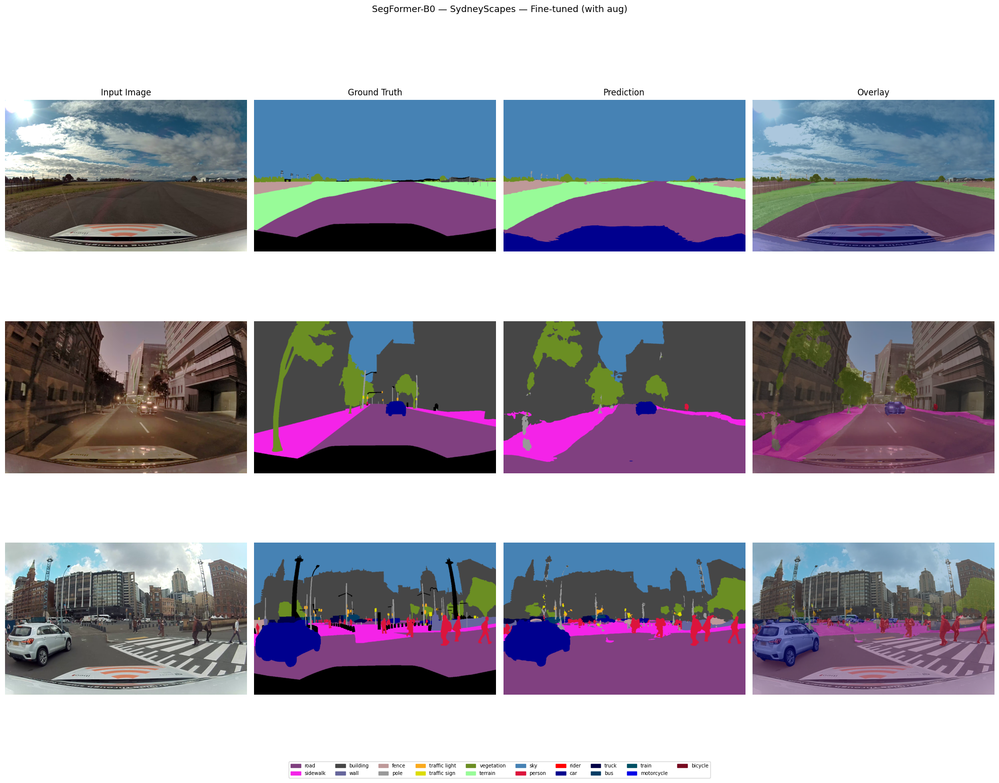

# Semantic Segmentation — Adapting SegFormer to Australian Road Scenes

A Computer Vision study on **semantic segmentation** for autonomous-driving perception,
focused on the **domain-shift** problem: models trained on European street scenes degrade
when applied to Australian roads.

## What it does

The notebook implements a full experimental pipeline around **SegFormer-B0**:

- **Baseline evaluation** on Cityscapes (European) and SydneyScapes (Australian) to quantify
  the domain gap.
- **Fine-tuning** SegFormer-B0 to Australian road environments.
- **Evaluation** of the adapted model, comparing performance before vs. after adaptation.

The study weighs segmentation quality against model size and compute cost, and discusses the
ethical implications of perception models that underperform on under-represented environments.

## Key results

- **Baseline SegFormer-B0:** 71.9% mIoU on Cityscapes at ~123 FPS — a strong
  accuracy/efficiency trade-off.
- **Domain gap:** performance collapses to **32.6% mIoU** on SydneyScapes, exposing how poorly
  Europe-trained models transfer to Australian roads.
- **After fine-tuning:** SydneyScapes mIoU recovers to **57.3%**, beating the 48.98% reported in
  the literature — while keeping the model lightweight and real-time.

*Input · ground truth · prediction · overlay, after fine-tuning on SydneyScapes.*

## Contents

| File | Description |
|------|-------------|
| `semantic-segmentation.ipynb` | Full experimental pipeline (with rendered results) |
| `report.pdf` | Final research report — methodology, results and analysis |

## Data

- **Cityscapes** — urban street scenes (Europe). Available from the official Cityscapes site.
- **SydneyScapes** — Australian road scenes. Not redistributed here; see the original source.

*Model:* SegFormer-B0 (Hugging Face Transformers). *Task:* multi-class semantic segmentation.
