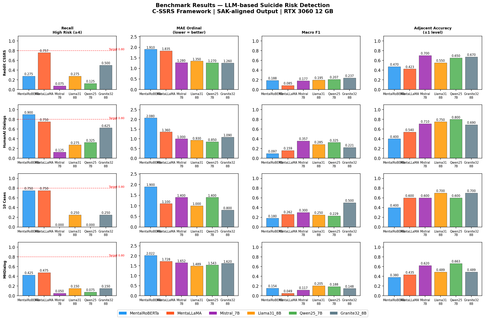

# LLM-Based Suicide-Risk Detection

An NLP / LLM study evaluating whether **open large and small language models** can classify
suicide risk from conversational text, mapped to the clinical **Columbia Suicide Severity
Rating Scale (C-SSRS)**. The goal: identify which models and prompting strategies are reliable
enough to support (never replace) clinical screening.

## What it does

- **Benchmarks multiple LLMs / SLMs** (e.g. Llama 3.1, Mistral, Qwen 2.5, Granite 3.2,
  MentaLLaMA, MentalRoBERTa) on clinical risk classification.
- **Compares prompting strategies** — zero-shot, few-shot, and few-shot + chain-of-thought —
  to measure how much prompting closes the gap with fine-tuned models.
- **Tests robustness to domain shift** across several mental-health datasets.
- Analyses primary metrics, confusion patterns and cross-dataset generalisation.

## Key results

- Models evaluated on **Quadratic Weighted Kappa, High-Risk Recall (sensitivity), MAE,
  Macro F1 and inference latency** — recall on high-risk cases treated as non-negotiable.
- **IBM Granite 3.2-8B** achieved the strongest balanced performance (High-Risk Recall 0.683).
- Final proposal: a **privacy-first hybrid** built on Llama-3.1-8B, engineered for a **100%
  high-risk-recall mandate** and **on-premise inference** so no patient transcript ever leaves
  the clinical network.

*Recall (high-risk), MAE, Macro F1 and adjacent accuracy across models and datasets.*

## Contents

| File | Description |
|------|-------------|
| `benchmark.ipynb` | Evaluation pipeline (**cell outputs cleared** — see note below) |
| `report.pdf` | Final research report — methodology, results and analysis |

## ⚠️ Data & ethics

This study uses **clinically sensitive, licensed mental-health datasets** (Reddit C-SSRS,
Human–AI suicide-risk dialogues, and others). **None of the raw data is included** in this
repository, and the notebook is committed with **all cell outputs cleared** so that no dataset
text is exposed. The datasets must be obtained directly from their original providers under
their respective access agreements.

This work is academic research into clinical decision *support*; it is not a diagnostic tool.
