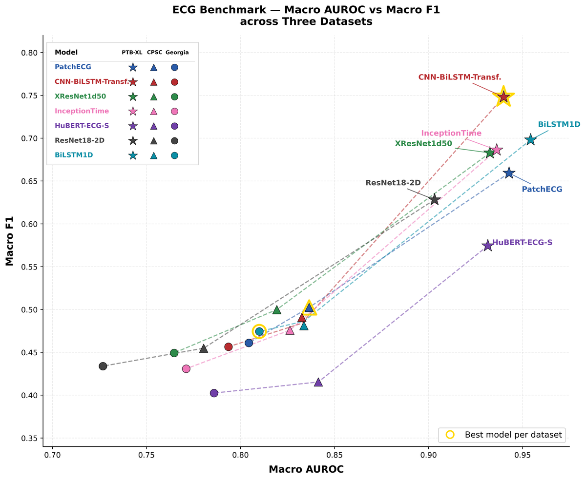

# ECG Classification Benchmark

A time-series deep-learning study benchmarking **7 deep-learning architectures** for
**7-class multilabel ECG diagnosis**, trained and evaluated across three clinical datasets:
**PTB-XL, CPSC 2018 and Georgia**. The study compares model families on accuracy,
parameter efficiency and explainability, and includes an explainability pipeline (SHAP +
clinical validation with NeuroKit).

## Models evaluated

| Model | Type | Params |
|-------|------|-------:|
| BiLSTM1D | Recurrent | ~0.7M |
| InceptionTime | 1D CNN | ~0.5M |
| XResNet1d50 | 1D CNN | ~18.5M |
| ResNet18-2D | 2D CNN (spectrogram) | ~11.2M |
| CNN-BiLSTM-Transformer | Hybrid | ~1.4M |
| PatchECG | 1D Vision Transformer | ~1.2M |
| HuBERT-ECG-S | Self-supervised (fine-tuned) | ~21M |

All models trained on PTB-XL (folds 1–8), validated on fold 9, tested on fold 10, then
evaluated for cross-dataset generalisation on CPSC 2018 and Georgia.

## Key results

- The hybrid **CNN-BiLSTM-Transformer** gave the strongest balanced performance:
  **Macro F1 0.748 / AUROC 0.940** on PTB-XL, with the lowest false-flagging rates across
  datasets.
- A **high-confidence, explainable** diagnostic pipeline (SHAP + NeuroKit clinical validation)
  reached **6/6 correct** classifications on held-out cases with clinically consistent
  explanations.

*Seven models across PTB-XL, CPSC 2018 and Georgia; the CNN-BiLSTM-Transformer leads.*

## Contents

| Path | Description |
|------|-------------|
| `code/experiments/` | Training + evaluation scripts, one per model |
| `code/explainaition_pipeline_POC/` | Explainability pipeline (SHAP, clinical validation) |
| `code/scripts/` | Dataset download and label-distribution utilities |
| `report.pdf` | Final research report — methodology, results and analysis |

## 👥 Team project

This was a **group research project**, published here with my
teammates' permission.

| Member | GitHub |
|--------|--------|
| Romina Lopez | [@romina-lopez-ai](https://github.com/romina-lopez-ai) |
| Santiago Boxiga | [@santiagoboxiga](https://github.com/santiagoboxiga) |
| Enkhjargal Togoo | [@Enkhjargal-Togoo](https://github.com/Enkhjargal-Togoo) |

## Data

PTB-XL, CPSC 2018 and Georgia are **public** ECG datasets (PhysioNet). They are **not
included** here; use the scripts in `code/scripts/` to download them from the original source.
